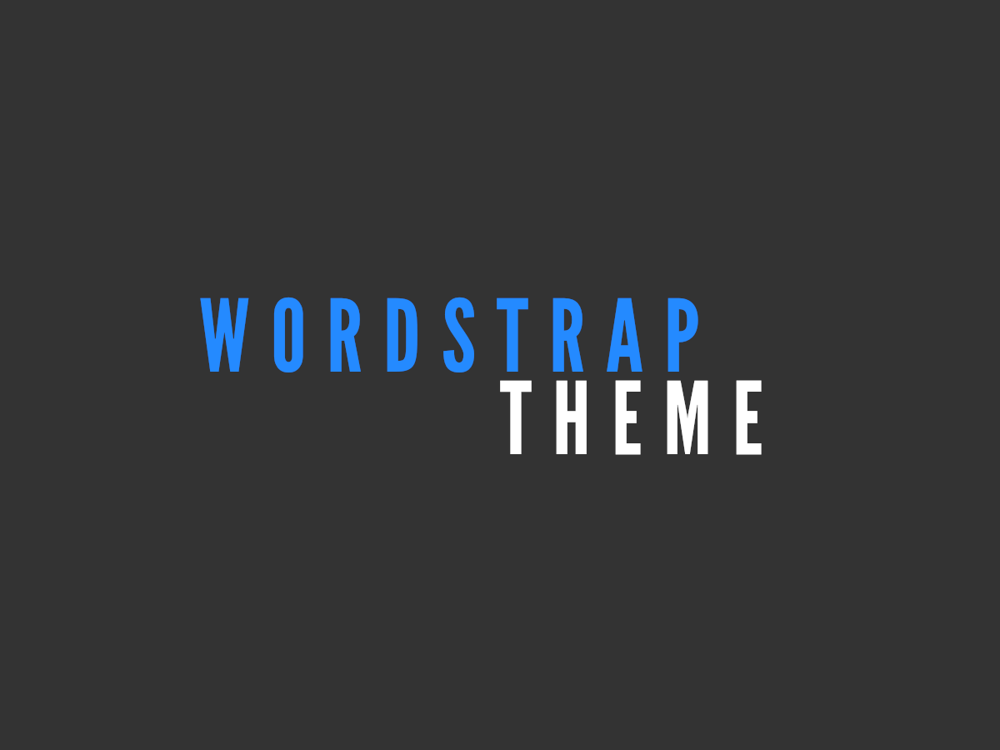
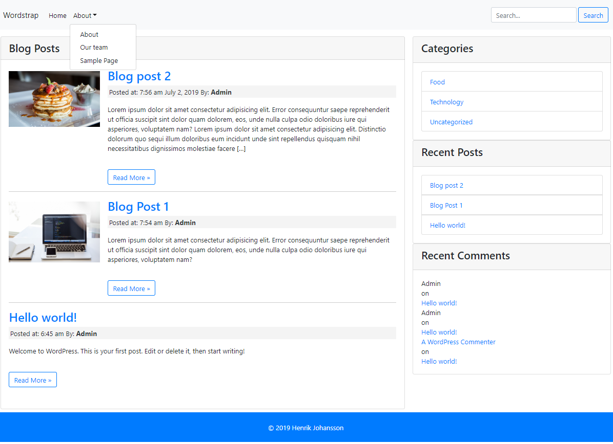

# Wordstraptheme 

A Wordpress theme utilizing the Bootstrap framweork and the wp-nav-walker (https://wp-bootstrap.github.io/wp-bootstrap-navwalker/) Based on a Eduonix course taught by Brad Traversy. I had to make some changes to that material to implement the Bootstrap 4 functionality.

The theme also contains customized versions of the Wordpress widget classes: 

* class-wp-widget-categories
* class-wp-widget-recent-comments
* class-wp-widget-recent-posts

## Theme Preview

